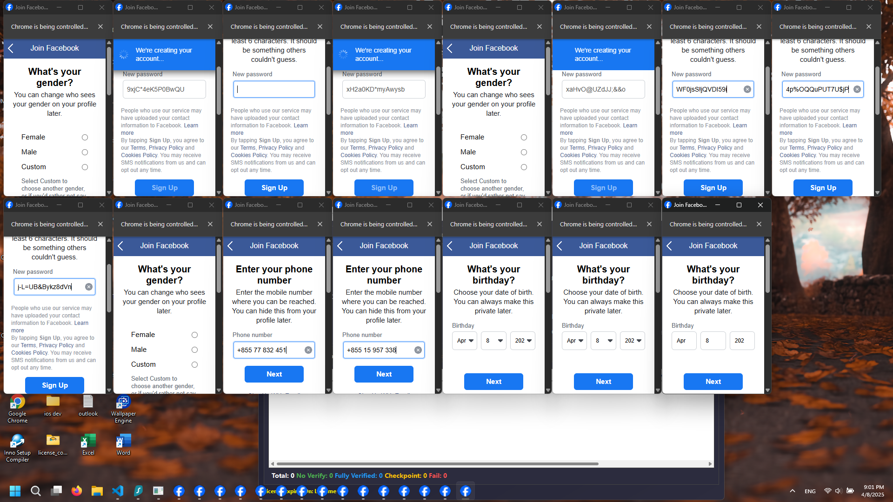
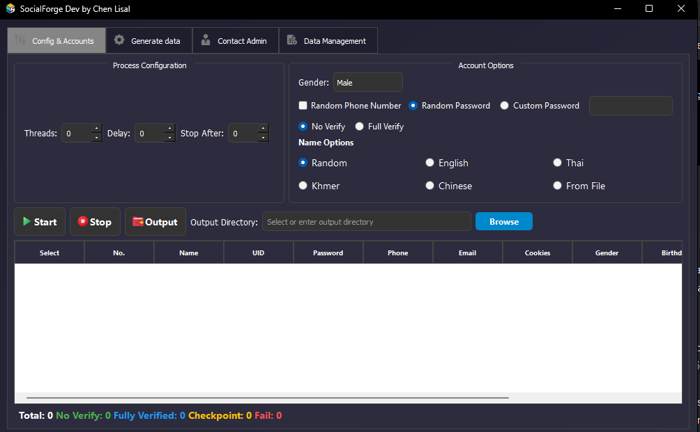
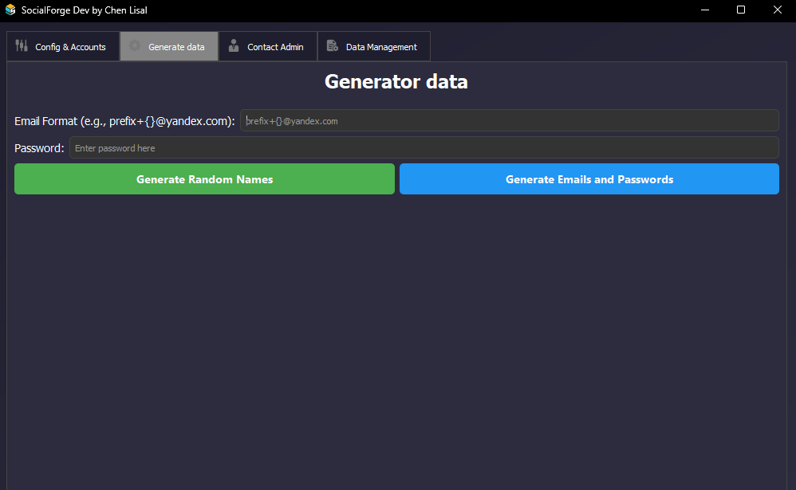
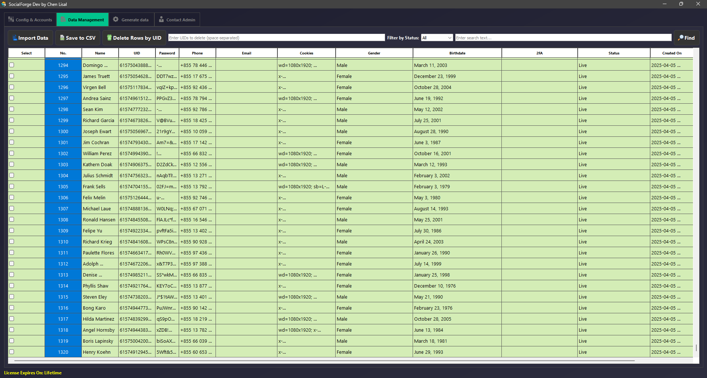

# SocialForge

<p align="center">
  
</p>

SocialForge is a Python desktop application developed by Chen Lisal using PyQt5 and Selenium.

The primary purpose of this project is to automate Facebook account creation workflows, manage account information, verify account status, and organize generated account data through a centralized desktop interface.

This project was built as a personal learning project to improve skills in Python programming, desktop application development, browser automation, multi-threading, data management, and software architecture.

---

## Screenshots

### Automation Workflow

<p align="center">
  
</p>

### Config & Accounts

<p align="center">
  
</p>

### Generate Data

<p align="center">
  
</p>

### Data Management

<p align="center">
  
</p>

---

## Features

### Account Creation Automation

* Automated Facebook registration workflow
* Multi-threaded account processing
* Random data generation
* Automatic form completion

### Data Generation

* Random first and last name generation
* English names
* Khmer names
* Thai names
* Chinese names
* Custom names from text files
* Random password generation
* Custom password support
* Random phone number generation

### Account Verification

* Email verification support
* Verification code retrieval through IMAP
* Full verification mode
* No verification mode

### Account Status Checking

* Detect successful accounts
* Detect fully verified accounts
* Detect checkpointed accounts
* Detect failed registrations
* Status tracking and reporting

### Data Management

* Import account data
* Export account data to CSV
* Search records
* Filter records by status
* Delete records by UID
* Store cookies and account information

### User Interface

* Desktop GUI built with PyQt5
* Dark-themed design
* Real-time task monitoring
* Multi-tab management system
* Statistics dashboard

---

## Technologies Used

* Python
* PyQt5
* Selenium WebDriver
* Requests
* BeautifulSoup4
* IMAP
* CSV Processing
* Multi-threading

---

## Project Workflow

Start Application

↓

Configure Threads, Delay, and Account Options

↓

Generate Names, Passwords, and Account Data

↓

Launch Browser Automation

↓

Submit Facebook Registration

↓

Email Verification (Optional)

↓

Account Status Detection

↓

Store UID, Cookies, Email, Password, and Account Information

↓

Manage Results

↓

Export Data to CSV

---

## Learning Objectives

This project was created to learn and practice:

* Python development
* Desktop application development
* Browser automation
* Multi-threaded programming
* Data management
* User interface design
* Web automation workflows
* Software architecture

---

## Installation

```bash
pip install -r requirements.txt
python SocialForge.py
```

---

## Author

Chen Lisal

## Support & Contact

If you have any questions, suggestions, bug reports, collaboration requests, or work opportunities, feel free to contact me.

**Telegram:** @chen_lisal
**Link:** https://t.me/chen_lisal

I am always open to feedback, discussions, and development opportunities.

---

## Disclaimer

This project was created for personal learning, experimentation, and software development practice.
